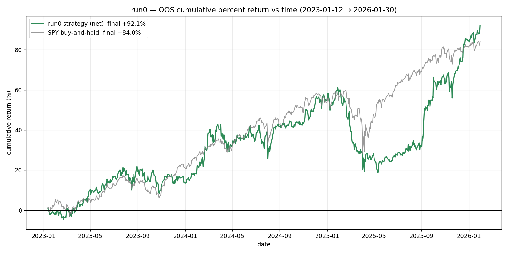

# QTA0 — Quant Trading Algorithm 0

A daily-frequency, cross-sectional US-equity **mixture-of-experts forecaster** (TACTIC-MoB v4),
built end-to-end, trained on Vertex AI, and **regime-robustly re-validated** with combinatorial
purged cross-validation and a full backtest-overfitting firewall.

This repo is meant to be **learned from**. It documents an honest research arc: a config that looked
like it beat SPY, and what happened when it was tested fairly.

## The one-paragraph result

A single historical configuration (**run0**) beat SPY *on CAGR* (+2.6%/yr) — but with a *worse*
Sharpe and drawdown, and the edge was mostly market beta plus a small, genuine stock-selection signal
(test hit 52.5%, t=+3.49). Every regime-fair re-validation — clean CPCV (run1), deep CPCV (run2), and
deep chronological (run2.1) — is an **honest NEGATIVE**: no net-of-cost edge. Test directional accuracy
falls cleanly the further the test set sits from training in time (52.5% → 51.1% → 50.5% → 49.7%) — the
fingerprint of concept drift. **Conclusion: not deployable.**



*run0's out-of-sample run (2023-2026): +92.1% vs SPY +84.0% — a real CAGR beat, but note the deeper
2025 drawdown (worse risk-adjusted path). The honest read of this and three regime-fair re-validations
is in [REPORT.md](REPORT.md).*

## Read these, in order

1. **[REPORT.md](REPORT.md)** — the full report: data, algorithms, all four runs, train/val/test
   accuracy, the core analysis, theory + literature, what's uncertain, how to reproduce.
2. **[notes.md](notes.md)** — the raw chronological lab log: every decision, bug, and idea.
3. **[PLAN.md](PLAN.md)** — the original build spec (18-channel features, experts f3/f4, decision layer).
4. **[revision_plan.md](revision_plan.md)** — the re-validation design (why CPCV, two runs, benchmarks).

## The four runs

| run | git branch | results dir | data | universe | validation | test hit | verdict |
|---|---|---|---|---|---|---|---|
| **run0** | `run0` | (branch only, @18e1896) | Alpaca SIP | 83 | chronological, adjacent | 52.5% (t=+3.49) | CAGR-beat only |
| **run1** | `run1` | `results/run1_clean_20260613/` | Alpaca SIP | 196 | CPCV(8,2) 28 folds | 51.1% (t=+5.36) | NEGATIVE |
| **run2** | `run2` | `results/run2_deep_20260613/` | yfinance | 153 | CPCV(10,2) 45 folds | 50.5% (t=+5.91) | NEGATIVE |
| **run2.1** | `run2.1` | `results/run2_1_chrono/` | yfinance | 153 | chronological, distant | 49.7% (t=−1.56) | NEGATIVE (coin-flip) |

`main` is the canonical branch (this README + full REPORT.md + run1/run2/run2.1 artifacts). Each run also
has its own labeled branch as an archival snapshot; run0's raw artifacts live on the `run0` branch.

> runs 2 / 2.1 use survivorship-biased free data → benchmarked only against their own pool, never SPY,
> never deployable. See REPORT.md §1.

## Layout

```
REPORT.md / notes.md / PLAN.md / revision_plan.md   the writeups
configs/v1.yaml      all hyperparameters + gate table
src/tactic/          library: features, experts (f3/f4), train, CPCV, backtest, firewall, reports
vertex/              cloud submit / finish (Vertex AI custom-jobs)
scripts/             one-off analysis (old-trader rerun, accuracy graph)
results/<run>/        per-run artifacts (RESULTS_*.md, report.json, plots)
tests/               pytest suite
data/ registry/      generated panels + honest-N ledger (gitignored, local only)
```

## Quickstart

```bash
pip install -e ".[dev]"
cp .env.example .env          # Alpaca / SEC credentials (only needed to rebuild the clean panel)
python make.py test           # run the test suite
```

Reproduce the analysis (predictions are already in `results/`):

```bash
python scripts/rerun_run21_oldtrader.py   # run0's trader on run2.1 preds
python scripts/graph_accuracy.py          # run0 vs run2.1 accuracy over OOS time
```

Heavy training runs on Vertex AI (`vertex/`); the finishers (`vertex/finish_run.py`) aggregate CPCV
folds and build the per-run reports locally.

## Non-negotiables (enforced in code)

Temporal PIT contracts, fit-scope discipline, no per-ticker models, single pinball objective, the deep
panel quarantined from the clean panel, an automatic honest-N trial ledger for deflation, and **no OOS
peeking**. See `PLAN.md §0.3`.
