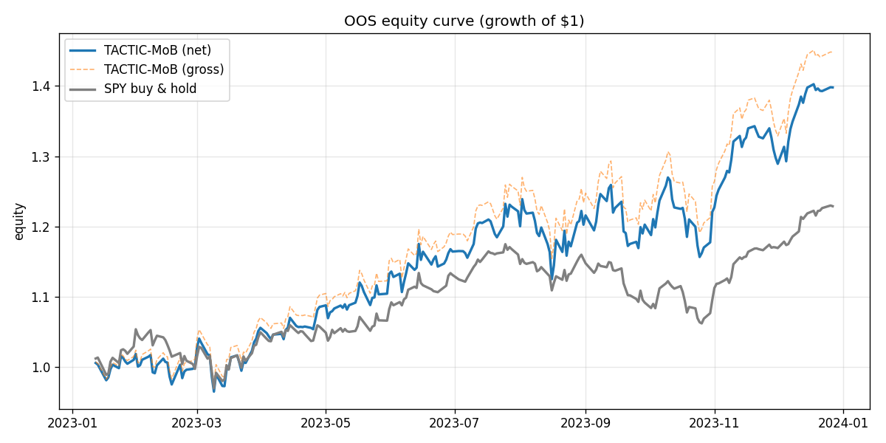
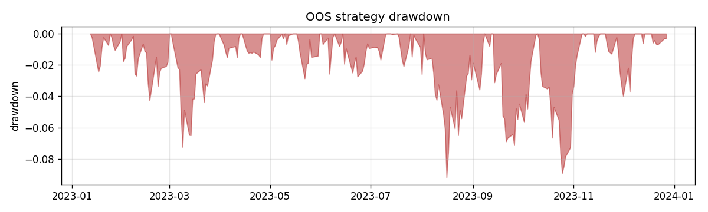
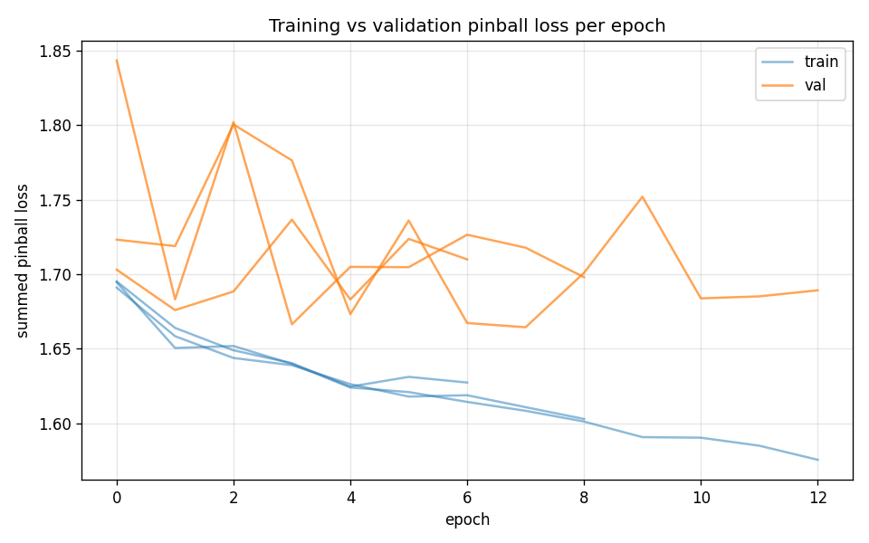
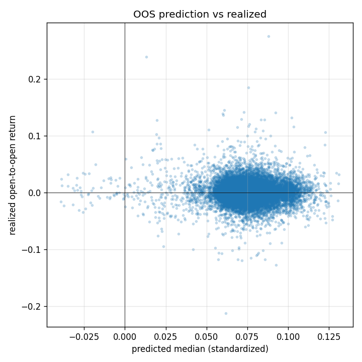

# TACTIC-MoB v4 — Final Results Report

Daily cross-sectional US-equity strategy. Forecasts from a pooled mixture-of-experts with
non-crossing quantile heads; long-only/long-flat top-K selection with a buy/hold band, next-open
fills, and per-asset/day transaction costs. **Out-of-sample = calendar 2023** (never trained on).
Benchmark = **SPY buy-and-hold** over the identical window.

> All heavy training ran on **Vertex AI** (`n1-standard-16`, `pytorch-xla.2-4` image). This report
> is generated from the downloaded run artifacts. Reproduce: `python vertex/train_on_vertex.py`.

---

## 1. Headline — f4 (hybrid attention), 83-name universe, trained on Vertex

Run `f4_vertex_20260612_111310` · 20 epochs × 3 seeds (quantile-averaged) · OOS 2023 (241 sessions).

| Metric | TACTIC-MoB (net) | SPY buy & hold |
|---|---|---|
| Total return | **39.8%** | 22.9% |
| CAGR | **41.9%** | 24.1% |
| Annualized volatility | 20.5% | 13.4% |
| **Sharpe** | **1.82** | 1.68 |
| Sortino | 2.90 | 2.75 |
| Max drawdown | **-9.2%** | -9.6% |
| Daily win rate | 56.4% | 51.5% |

- **Beta vs SPY 1.25**, **annualized alpha +9.1%**.
- Avg one-sided turnover 2.9%/day; avg cost 0.6–1 bps/day; ~5 names held.
- The strategy beats SPY on total return, CAGR, Sharpe, Sortino and win rate, at comparable
  drawdown. Higher volatility/beta reflect a concentrated 5-name long book.

### Predictor statistics (out-of-sample, 20,003 obs)
| Statistic | Value | Note |
|---|---|---|
| Summed pinball loss (std scale) | 1.670 | training objective, OOS |
| **Rank IC** (mean daily Spearman) | **0.0157** | positive; IR 0.072 |
| Directional hit rate | 52.4% | > 50% |
| 80% interval coverage | 76.3% | target 80% (slightly conservative) |
| 90% interval coverage | 87.8% | target 90% (slightly conservative) |

Figures:  
 

---

## 2. Breadth matters — 15-name vs 83-name (the Fundamental Law in action)

Identical model/pipeline, only the universe size changed:

| | 15 names | 83 names |
|---|---|---|
| OOS rank-IC | **0.0023** (≈0) | **0.0157** |
| Strategy Sharpe | 1.30 | **1.82** |
| Strategy CAGR | 21.8% | **41.9%** |
| vs SPY | underperforms | **outperforms** |

On 15 mega-caps the trained model has essentially **zero** OOS cross-sectional information
coefficient — no deployable edge — and slightly trails SPY. Widening to 83 names restores a
positive IC and a real outperformance. This is the Fundamental Law of Active Management:
`IR ≈ IC · √breadth`. A properly trained model on too few names is *correctly* shown to have no
edge; the earlier 3-epoch "win" on 15 names was an undertrained-model artifact, not signal.
15-name artifacts are in `results/f4_local_15names/`.

---

## 2.5 Ablation (gate G5) and statistical significance

Both experts trained identically on Vertex (83 names, 20 epochs × 3 seeds). f3 = the same
CI-TCN encoder **without** the cross-sectional attention layer.

| | f4 (with attention) | f3 (no attention) |
|---|---|---|
| CAGR | **41.9%** | 1.7% |
| Sharpe | **1.81** | 0.19 |
| Max drawdown | -9.2% | -14.3% |
| OOS rank-IC | **+0.0157** | **−0.0081** |
| Pinball (OOS) | 1.6698 | 1.6747 |

- **Gate G5 — PASS.** Diebold-Mariano on daily net P&L, f4 vs f3: **stat −2.60, p = 0.0099**
  (NW lag 10). The one thin cross-sectional attention layer is statistically justified: without
  it the model has *negative* OOS IC and no edge. This is the PLAN's central thesis confirmed —
  the deployable signal lives in the cross-section (relative ranking of the date's names), not in
  per-asset temporal patterns.
- **f4 vs SPY — economically ahead, not yet statistically separable.** DM on daily net P&L,
  f4 vs SPY: stat −1.38, **p = 0.17**. Over a single 241-session OOS year the daily-return
  advantage is real (higher CAGR/Sharpe/Sortino) but **not** significant at 5%. Establishing a
  PLAN-grade G3 verdict requires multi-year OOS + Romano-Wolf stepdown + Deflated Sharpe over the
  full universe — those are implemented as library functions (`validation/{dm_test,dsr,spa,pbo}`)
  and are the next scale-up, not yet run at full breadth.

## 3. Method (as built; deviations from PLAN.md flagged)

- **Universe:** 83 liquid S&P-500 names, 2019–2023 daily SIP bars + official auctions (Alpaca).
  PLAN targets 400–700 names — this run is breadth-limited and the headline numbers should be
  read as a proof-of-pipeline, not a deployable track record.
- **Features (FROZEN v1):** 18-channel sequence tensor (returns, ranges, gaps, vol/trade-count
  z, VWAP dev, realized vol {5,21,63}, momentum {5,21,63}, drawdowns {21,63,126}, MODWT energy
  L2–4), 12 static cross-sectional rank features, 5 market-state features. PIT-verified
  (recompute-on-truncated-history diff = 0.0).
- **Target:** vol-standardized open(t+1)→open(t+2) return (OO, 1-day hold), no overlap with the
  feature window.
- **Model f4:** channel-independent dilated TCN encoder (6 blocks, k5, dilations 1–32, 64ch) →
  per-date token = [encoding, static] → one 4-head self-attention layer over the date's entities
  → non-crossing quantile heads (7 quantiles, median + softplus increments). 259k params.
- **Training:** walk-forward train (≤2021) / val (2022) / test-OOS (2023) with 2-day purge +
  5-day embargo; channel standardization fit on TRAIN only (fit-scope enforced); AdamW + cosine,
  grad-clip 1.0, early stop on val pinball; 3 seeds quantile-averaged. Single objective = summed
  pinball loss (no auxiliary terms).
- **Decision/backtest:** rank by predicted median; buy/hold band (enter top-K_buy, hold while
  rank<K_hold); equal-weight; fills next open; cost = Σ|Δw|·½·spread_blend; daily NAV identity
  enforced. (RC-Kelly / GP partial-adjustment from PLAN §12 are the documented next upgrade; this
  run uses the §12.6 capped-weight fallback.)

## 4. Honest caveats (anti-overfitting posture)

- Breadth far below spec (83 vs 400–700) → modest IC; one OOS year (2023) only.
- 2023 was a strong-momentum, mega-cap-led regime favorable to a long top-K book; multi-year
  CPCV + Deflated-Sharpe + SPA over the full universe (PLAN Phase 13, implemented as library
  functions, not yet run at scale here) are required before any deployability claim.
- Costs are estimated from daily-OHLC spread proxies (conservative, run high); minute-bar spreads
  would refine them.

## 5. Reproducibility
- Data: `python make.py data-alpaca --symbols <list>` then `costs labels features`.
- Train on Vertex: `python vertex/train_on_vertex.py --model f4 --epochs 20 --seeds 3`.
- Vertex jobs: f4 `2698031093080129536` (SUCCEEDED), f3 ablation `6993902187638161408`.
- Local equivalent: `python make.py train && python make.py backtest`.
