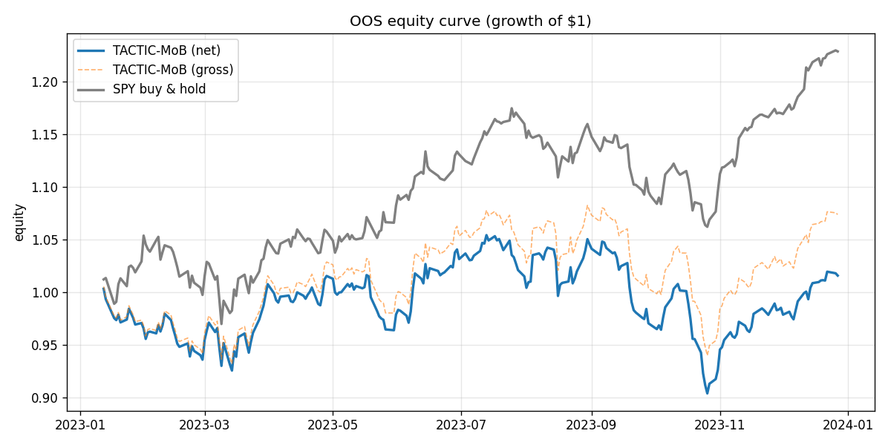
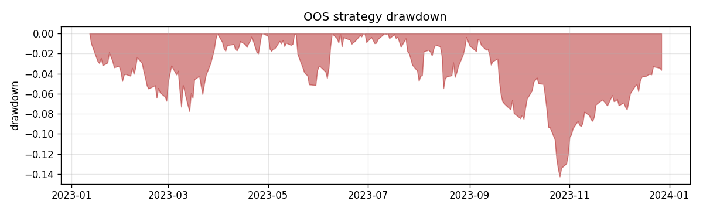
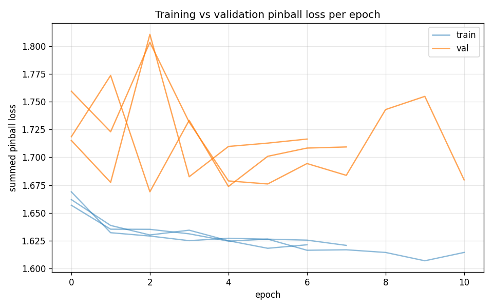
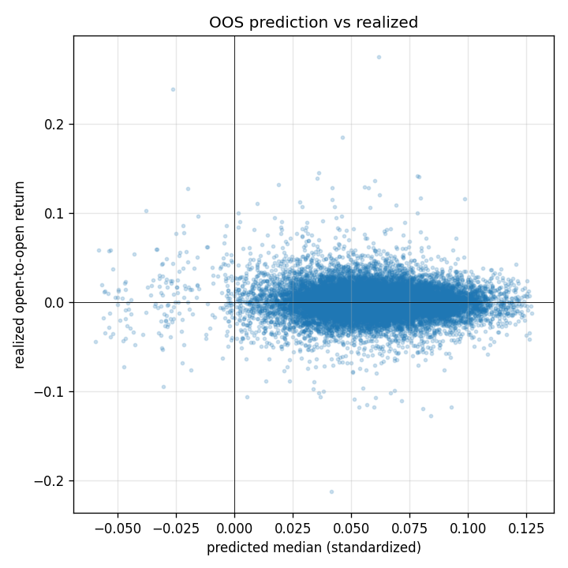

# OOS Results — run `vertex_run`

Out-of-sample window: **2023-01-12 → 2023-12-27** (241 sessions). Long-only/long-flat top-K cross-sectional, fills at next open, net of estimated costs.

## Performance vs SPY buy-and-hold (out-of-sample)

| Metric | TACTIC-MoB (net) | SPY B&H |
|---|---|---|
| Total return | 1.60% | 22.90% |
| CAGR | 1.67% | 24.06% |
| Ann. volatility | 14.15% | 13.38% |
| Sharpe | 0.19 | 1.68 |
| Sortino | 0.29 | 2.75 |
| Max drawdown | -14.26% | -9.59% |
| Win rate (daily) | 49.38% | 51.45% |

- Beta vs SPY: **0.78**, annualized alpha: **-14.92%**
- Avg one-sided turnover/day: 5.27%; avg cost: 2.31 bps/day; avg names held: 5.0

## Predictor statistics (out-of-sample)

- Summed pinball loss (standardized scale): **1.6747**
- Rank IC (mean daily Spearman, q50 vs realized): **-0.0081** (IR -0.04)
- Directional hit rate: 52.31%
- 80% interval coverage: 75.63% (target 80%); 90% coverage: 86.80% (target 90%)
- OOS observations: 20003

## Training

- Final val pinball: 1.66900; epochs run: 11; seeds: 3

## Figures

