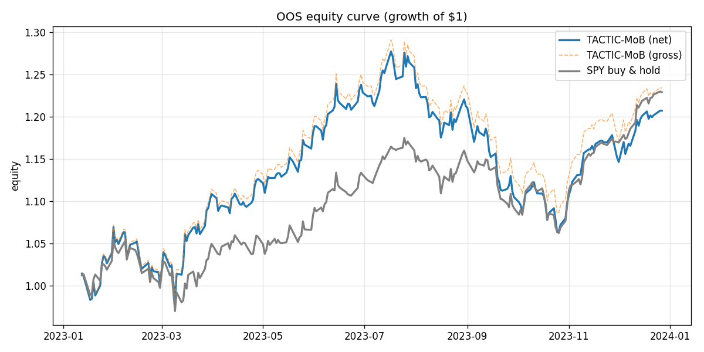
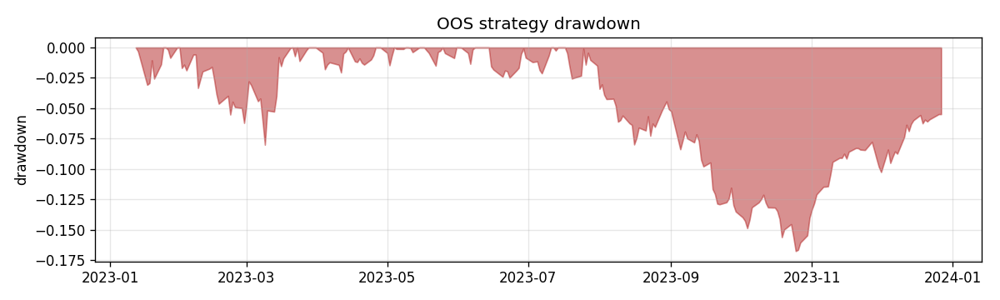
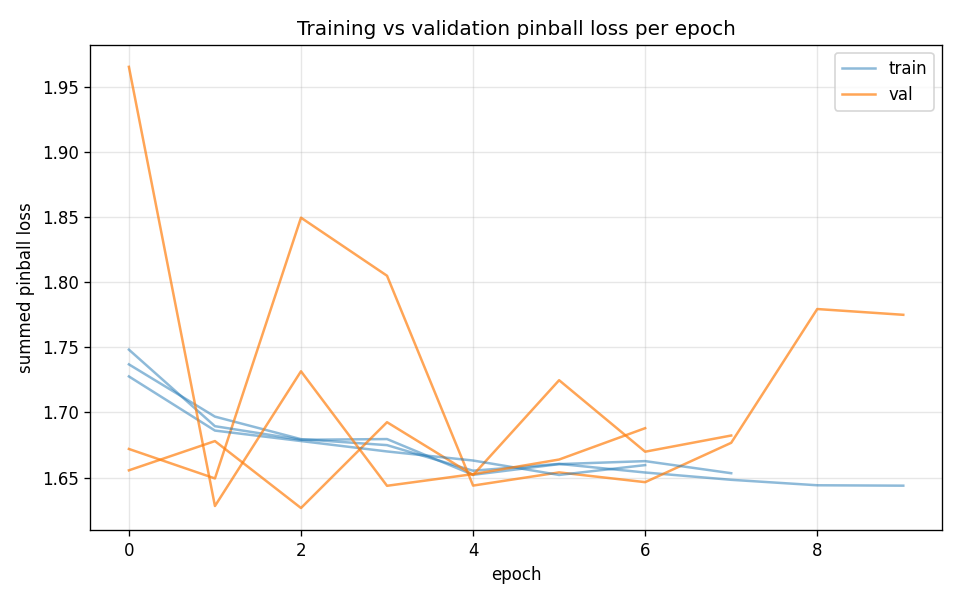
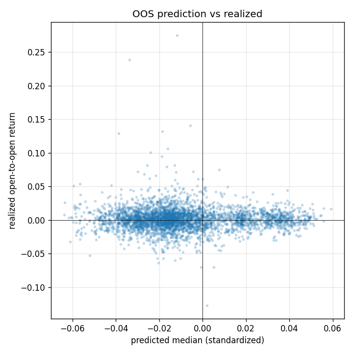

# OOS Results — run `f4_20260612_104415`

Out-of-sample window: **2023-01-12 → 2023-12-27** (241 sessions). Long-only/long-flat top-K cross-sectional, fills at next open, net of estimated costs.

## Performance vs SPY buy-and-hold (out-of-sample)

| Metric | TACTIC-MoB (net) | SPY B&H |
|---|---|---|
| Total return | 20.72% | 22.90% |
| CAGR | 21.76% | 24.06% |
| Ann. volatility | 16.15% | 13.38% |
| Sharpe | 1.30 | 1.68 |
| Sortino | 2.02 | 2.75 |
| Max drawdown | -16.74% | -9.59% |
| Win rate (daily) | 53.11% | 51.45% |

- Beta vs SPY: **1.05**, annualized alpha: **-2.56%**
- Avg one-sided turnover/day: 2.03%; avg cost: 0.92 bps/day; avg names held: 5.0

## Predictor statistics (out-of-sample)

- Summed pinball loss (standardized scale): **1.6550**
- Rank IC (mean daily Spearman, q50 vs realized): **0.0023** (IR 0.01)
- Directional hit rate: 47.58%
- 80% interval coverage: 73.67% (target 80%); 90% coverage: 85.92% (target 90%)
- OOS observations: 3615

## Training

- Final val pinball: 1.62671; epochs run: 10; seeds: 3

## Figures

