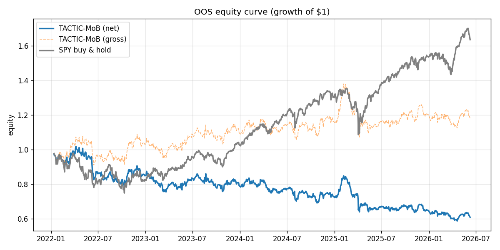
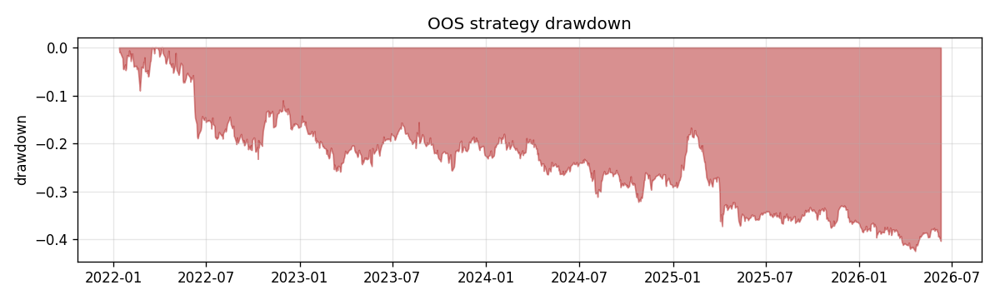
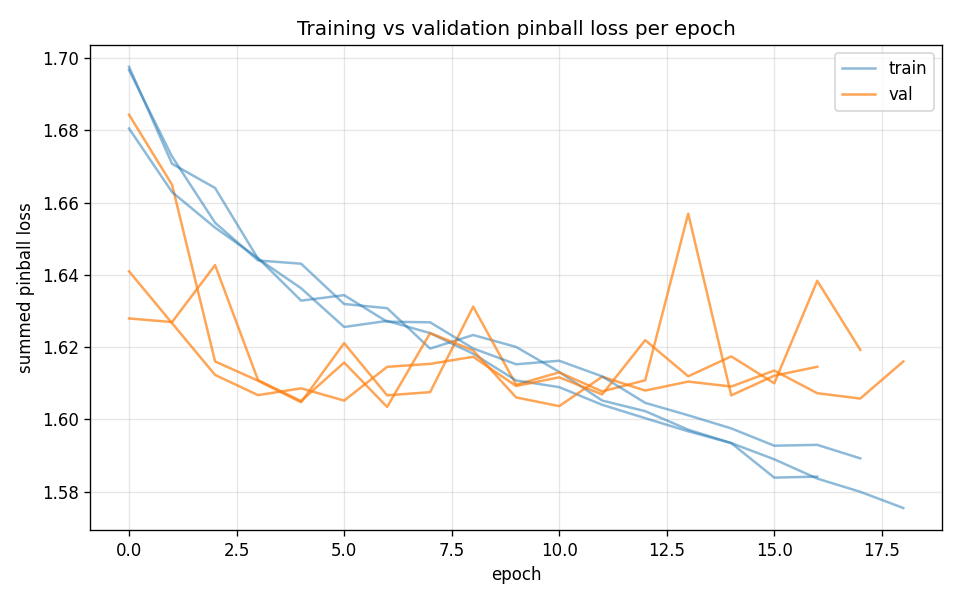
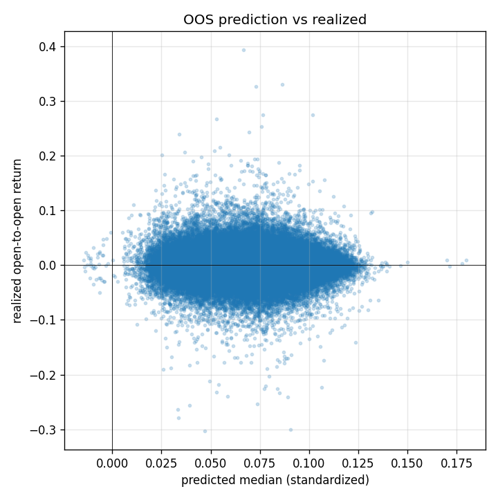

# OOS Results — run `vertex_run`

Out-of-sample window: **2022-01-12 → 2026-06-09** (1105 sessions). Long-only/long-flat top-K cross-sectional, fills at next open, net of estimated costs.

## Performance vs SPY buy-and-hold (out-of-sample)

| Metric | TACTIC-MoB (net) | SPY B&H |
|---|---|---|
| Total return | -39.24% | 63.61% |
| CAGR | -10.74% | 11.88% |
| Ann. volatility | 17.42% | 17.87% |
| Sharpe | -0.56 | 0.72 |
| Sortino | -0.74 | 0.97 |
| Max drawdown | -42.44% | -23.50% |
| Win rate (daily) | 51.04% | 53.48% |

- Beta vs SPY: **0.64**, annualized alpha: **-18.06%**
- Avg one-sided turnover/day: 14.65%; avg cost: 6.00 bps/day; avg names held: 5.0

## Predictor statistics (out-of-sample)

- Summed pinball loss (standardized scale): **1.6677**
- Rank IC (mean daily Spearman, q50 vs realized): **0.0149** (IR 0.07)
- Directional hit rate: 51.77%
- 80% interval coverage: 76.02% (target 80%); 90% coverage: 87.32% (target 90%)
- OOS observations: 216280

## Training

- Final val pinball: 1.60343; epochs run: 19; seeds: 3

## Figures

