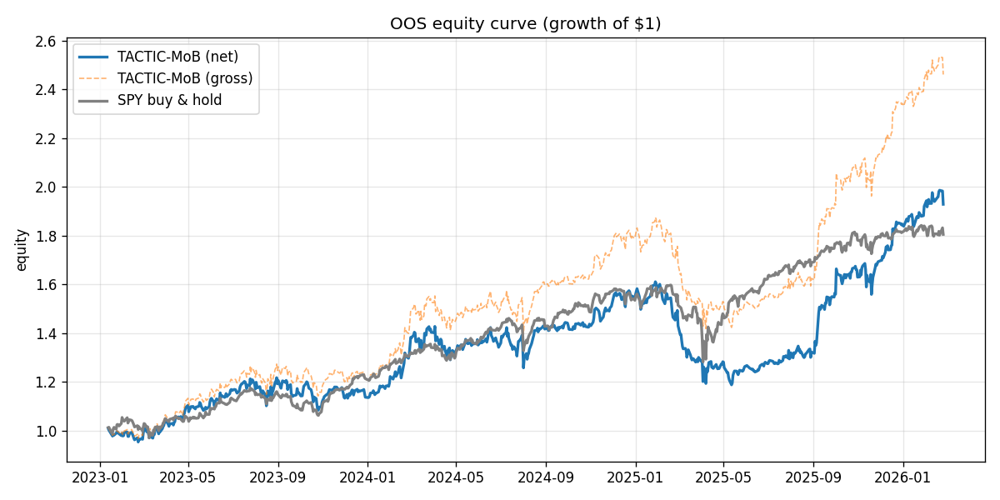
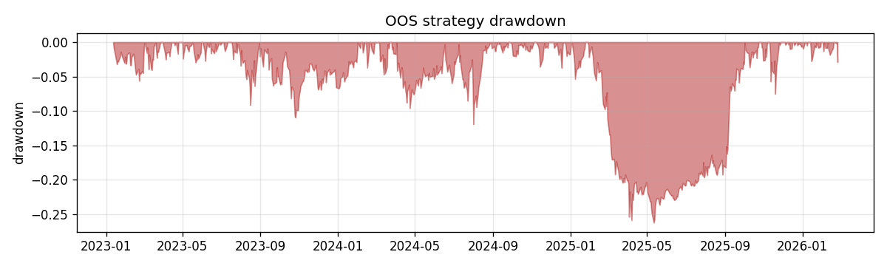
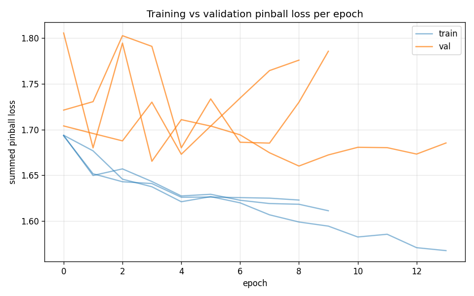
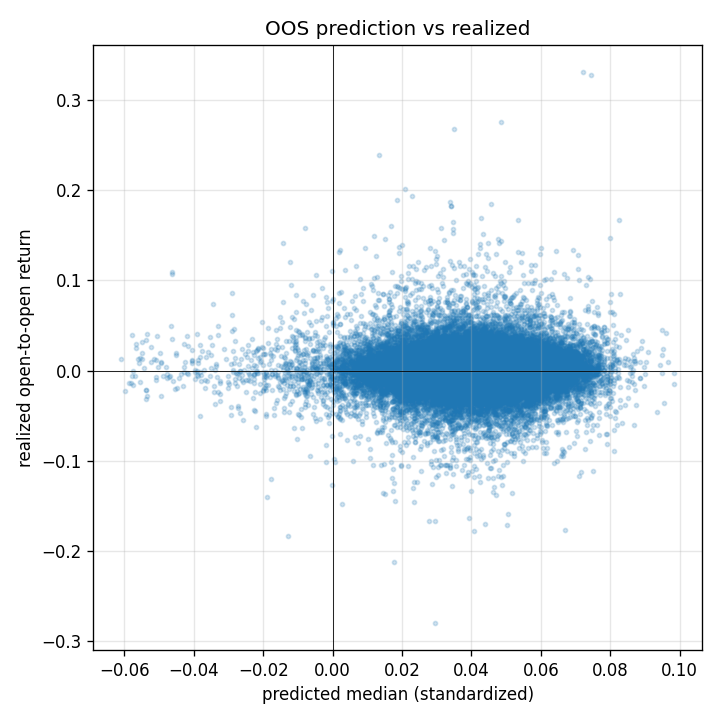

# OOS Results — run `vertex_run`

Out-of-sample window: **2023-01-12 → 2026-02-25** (782 sessions). Long-only/long-flat top-K cross-sectional, fills at next open, net of estimated costs.

## Performance vs SPY buy-and-hold (out-of-sample)

| Metric | TACTIC-MoB (net) | SPY B&H |
|---|---|---|
| Total return | 92.89% | 80.54% |
| CAGR | 23.58% | 20.97% |
| Ann. volatility | 21.25% | 15.71% |
| Sharpe | 1.10 | 1.29 |
| Sortino | 1.59 | 1.69 |
| Max drawdown | -26.26% | -19.77% |
| Win rate (daily) | 53.84% | 55.12% |

- Beta vs SPY: **0.94**, annualized alpha: **4.33%**
- Avg one-sided turnover/day: 6.23%; avg cost: 3.12 bps/day; avg names held: 5.0

## Predictor statistics (out-of-sample)

- Summed pinball loss (standardized scale): **1.6861**
- Rank IC (mean daily Spearman, q50 vs realized): **0.0143** (IR 0.07)
- Directional hit rate: 52.52%
- 80% interval coverage: 74.75% (target 80%); 90% coverage: 86.06% (target 90%)
- OOS observations: 64906

## Training

- Final val pinball: 1.66017; epochs run: 14; seeds: 3

## Figures

