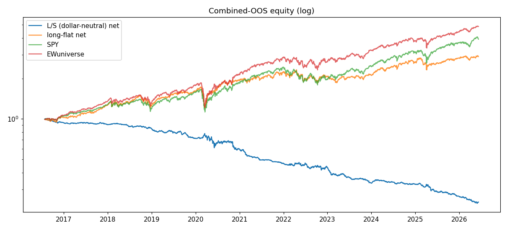
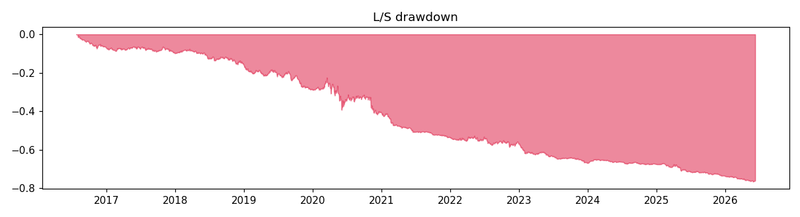
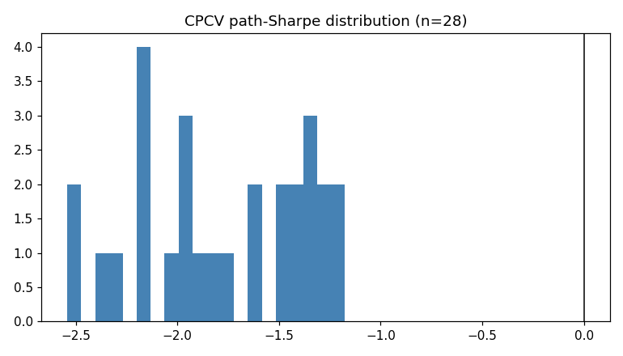

# RESULTS — RUN 1 (CLEAN, deployable-grade)

Alpaca SIP 2016-2026, 196-name universe, CPCV combined out-of-sample.

- Primary benchmark: **SPY** | books: dollar-neutral L/S + long-flat breadth
- Honest N (registry trials): **17**
- CPCV paths: n=28, mean Sharpe -1.769 (std 0.416), frac>0 0.00

## Books vs benchmarks (combined OOS)

### long_short  (ann Sharpe -1.494, turnover 0.081, cost 4.0bps, 2482 days)

| benchmark | strat CAGR | bench CAGR | strat Sharpe | alpha (ann) | beta | maxDD |
|---|---|---|---|---|---|---|
| SPY | -13.4% | +14.9% | -1.49 | -11.1% | -0.19 | -76.5% |
| EWuniverse | -13.4% | +17.4% | -1.49 | -9.8% | -0.24 | -76.5% |

### long_flat  (ann Sharpe 0.767, turnover 0.020, cost 0.9bps, 2482 days)

| benchmark | strat CAGR | bench CAGR | strat Sharpe | alpha (ann) | beta | maxDD |
|---|---|---|---|---|---|---|
| SPY | +11.4% | +14.9% | 0.77 | -0.1% | 0.79 | -30.3% |
| EWuniverse | +11.4% | +17.4% | 0.77 | -2.0% | 0.81 | -30.3% |

## Predictor diagnostics (OOS)

- IC mean 0.0200 (IR 0.093), hit 0.511, pinball 1.6453
- coverage 80/90: 0.747 / 0.858, n_obs 483066

## Per-year (L/S vs primary)

| year | strat | bench | strat Sharpe |
|---|---|---|---|
| 2016 | -6.4% | +5.0% | -3.32 |
| 2017 | -3.1% | +21.5% | -0.73 |
| 2018 | -6.7% | -6.4% | -1.28 |
| 2019 | -15.4% | +31.8% | -2.29 |
| 2020 | -16.6% | +16.8% | -0.82 |
| 2021 | -22.0% | +31.9% | -3.70 |
| 2022 | -6.9% | -18.7% | -0.58 |
| 2023 | -23.1% | +24.6% | -3.16 |
| 2024 | -1.7% | +26.5% | -0.30 |
| 2025 | -19.0% | +18.2% | -2.37 |
| 2026 | -9.1% | +6.4% | -2.87 |

## Per-regime (L/S vs primary)

| regime | strat | bench | strat Sharpe | maxDD |
|---|---|---|---|---|
| 2016H2-17 low-vol bull | -9.3% | +27.6% | -1.56 | -9.8% |
| 2018 volmageddon | -2.2% | +9.3% | -0.67 | -6.7% |
| 2018Q4 correction | -4.5% | -14.4% | -2.50 | -4.3% |
| 2019 rate-cut bull | -15.4% | +31.8% | -2.29 | -15.2% |
| 2020 COVID crash | +4.7% | -23.2% | 1.60 | -5.8% |
| 2020 V-recovery | -20.3% | +52.0% | -1.28 | -21.4% |
| 2021 melt-up | -22.0% | +31.9% | -3.70 | -21.3% |
| 2022 rate-hike BEAR | -6.9% | -18.7% | -0.58 | -12.4% |
| 2023Q1 bank crisis | -12.4% | +7.8% | -4.90 | -13.1% |
| 2023 narrow AI rally | -12.3% | +15.6% | -2.40 | -15.0% |
| 2024 broad bull | -1.7% | +26.5% | -0.30 | -7.8% |
| 2025 tariff vol | -19.0% | +18.2% | -2.37 | -20.2% |
| 2026H1 elevated vol | -9.1% | +6.4% | -2.87 | -10.8% |

## Firewall (reported, NOT enforced)

- **DSR** = 0.000 (SR -0.0941, SR0 0.0479, N 17, T 2482) — gate dsr_min 0.95 → FAIL
- **PBO** = 0.0 (configs 4) — gate pbo_max 0.20 → PASS
- **DM vs SPY**: stat 4.332, p 0.000, meanΔ 1.16e-03 (neg stat = strat better)
- **DM vs EWuniverse**: stat 4.534, p 0.000, meanΔ 1.25e-03 (neg stat = strat better)

## Diagnosis — gross vs net, and why positive IC ≠ profit

| metric | value |
|---|---|
| IC(q50, standardized target) | +0.0200 (IR 0.093) |
| IC(q50, **raw** open→open return) | **+0.0081** |
| L/S **gross** ann return / Sharpe | **−4.35% / −0.43** |
| L/S **net** ann return / Sharpe | −13.43% / −1.49 |
| avg cost | ~4.0 bps/day ≈ ~10%/yr |

**Read:** the cross-sectional signal is *weakly positive but economically negligible* (raw IC ≈ 0.008,
hit-rate 0.511). It is **not** collapsed — per-fold S1 margins are +0.9%…+1.4% (model conditions on
features; the prior constant-collapse is fixed) and q50 dispersion ≈ 0.018–0.021. But the edge is too
weak to monetize at the top/bottom-35 tails: the long–short book is **already negative gross**
(−4.4%/yr) before costs, and the ~10%/yr bid–ask cost of a daily-rebalanced book turns that into
−13.4%/yr net. The long-flat book makes money only as down-levered market beta (β 0.79, alpha ≈ 0
vs SPY and vs the equal-weight universe). Across all **28 regime-fair CPCV paths the net Sharpe is
negative** (mean −1.77, frac>0 = 0.00); DSR ≈ 0 (≪0.95); DM says the strategy is *significantly worse*
than SPY/EW (p≈0). PBO=0.0 only means the book-config ranking is stable (consistently bad, not
overfit-lucky).

**Verdict (deployable-grade):** clean **NEGATIVE — do not deploy.** This strengthens the prior
finding (which used a single chronological OOS) with a regime-fair combinatorial OOS: the daily
cross-sectional signal in this 196-name universe has no net-of-cost edge, in any regime except a mild
defensive tilt during the 2020 COVID crash (+4.7%, Sharpe 1.60) and the 2022 bear (−6.9% vs SPY
−18.7%, i.e. loses less). A clean negative is a valid result (revision_plan §8.5).
