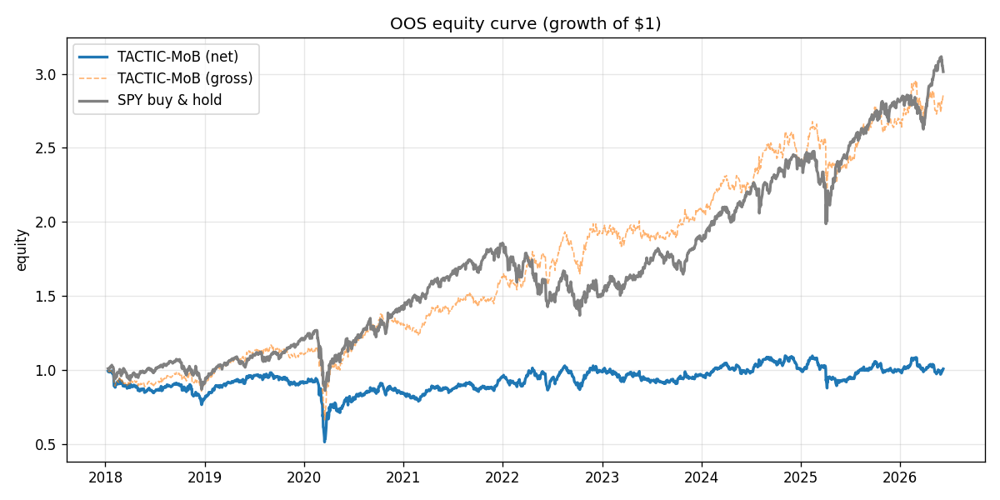
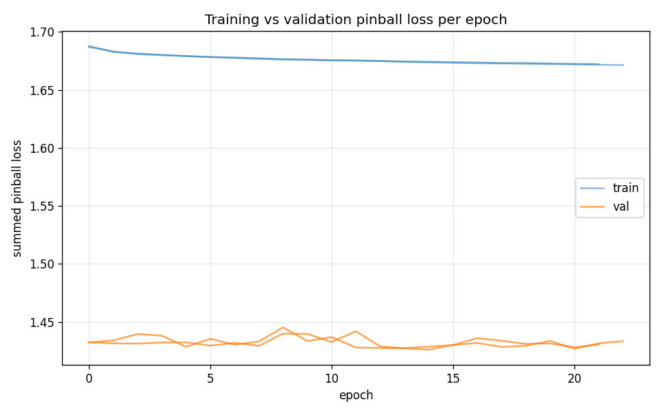
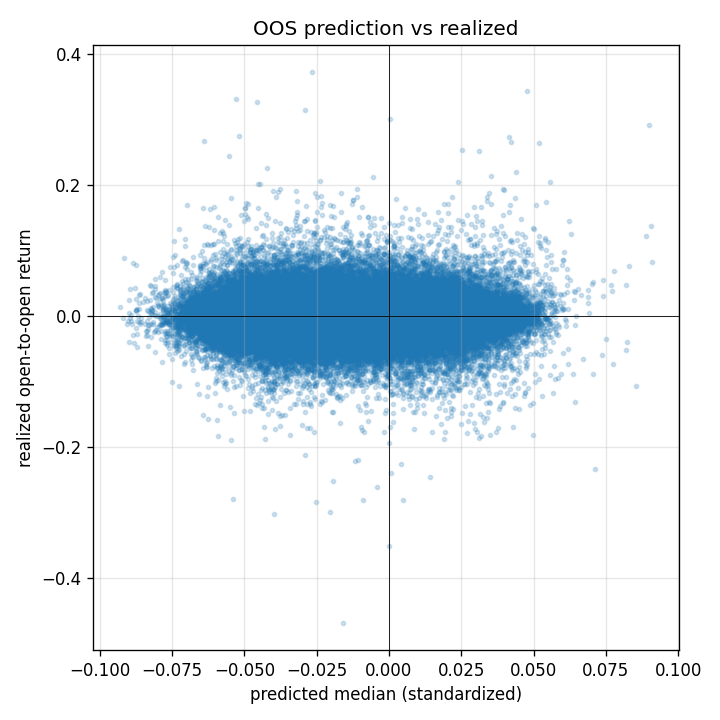

# OOS Results — run `vertex_run`

Out-of-sample window: **2018-01-11 → 2026-06-08** (2112 sessions). Long-only/long-flat top-K cross-sectional, fills at next open, net of estimated costs.

## Performance vs SPY buy-and-hold (out-of-sample)

| Metric | TACTIC-MoB (net) | SPY B&H |
|---|---|---|
| Total return | 0.88% | 201.44% |
| CAGR | 0.10% | 14.07% |
| Ann. volatility | 18.39% | 18.45% |
| Sharpe | 0.10 | 0.81 |
| Sortino | 0.12 | 0.99 |
| Max drawdown | -48.20% | -32.05% |
| Win rate (daily) | 52.04% | 55.54% |

- Beta vs SPY: **0.62**, annualized alpha: **-7.39%**
- Avg one-sided turnover/day: 11.41%; avg cost: 4.93 bps/day; avg names held: 5.0

## Predictor statistics (out-of-sample)

- Summed pinball loss (standardized scale): **1.7078**
- Rank IC (mean daily Spearman, q50 vs realized): **0.0106** (IR 0.05)
- Directional hit rate: 49.68%
- 80% interval coverage: 68.87% (target 80%); 90% coverage: 81.71% (target 90%)
- OOS observations: 323136

## Training

- Final val pinball: 1.42615; epochs run: 23; seeds: 2

## Figures

