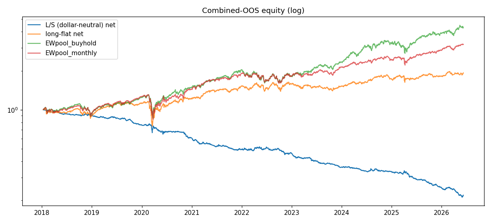
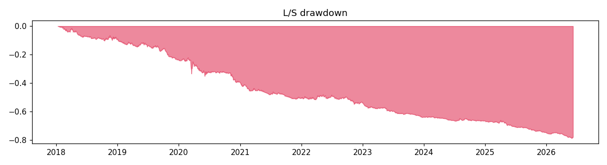

# RESULTS — RUN 2 (DEEP, EXPLORATORY)

> **SURVIVORSHIP-BIAS CAVEAT (read first).** This run uses free yfinance daily history
> for a pool of names that *survived to today*; delisted/dead tickers are absent, so
> absolute returns are upward-biased. It is benchmarked ONLY against equal-weight
> buy-and-hold of its OWN pool (bias cancels in the relative comparison). It is
> **NOT deployable** and is **never** to be headlined vs SPY.

- Primary benchmark: **EWpool_buyhold** | books: dollar-neutral L/S + long-flat breadth
- Honest N (registry trials): **17**
- CPCV paths: n=0, mean Sharpe nan (std nan), frac>0 nan

## Books vs benchmarks (combined OOS)

### long_short  (ann Sharpe -1.967, turnover 0.104, cost 5.5bps, 2112 days)

| benchmark | strat CAGR | bench CAGR | strat Sharpe | alpha (ann) | beta | maxDD |
|---|---|---|---|---|---|---|
| EWpool_buyhold | -16.6% | +19.0% | -1.97 | -18.1% | 0.02 | -78.8% |
| EWpool_monthly | -16.6% | +14.8% | -1.97 | -18.0% | 0.02 | -78.8% |

### long_flat  (ann Sharpe 0.567, turnover 0.025, cost 1.2bps, 2112 days)

| benchmark | strat CAGR | bench CAGR | strat Sharpe | alpha (ann) | beta | maxDD |
|---|---|---|---|---|---|---|
| EWpool_buyhold | +8.1% | +19.0% | 0.57 | +8.6% | 0.03 | -35.6% |
| EWpool_monthly | +8.1% | +14.8% | 0.57 | +8.7% | 0.03 | -35.6% |

## Predictor diagnostics (OOS)

- IC mean 0.0106 (IR 0.048), hit 0.497, pinball 1.7078
- coverage 80/90: 0.689 / 0.817, n_obs 323136

## Per-year (L/S vs primary)

| year | strat | bench | strat Sharpe |
|---|---|---|---|
| 2018 | -9.2% | -5.4% | -1.47 |
| 2019 | -16.2% | +31.5% | -2.79 |
| 2020 | -20.5% | +20.6% | -1.52 |
| 2021 | -18.5% | +35.3% | -2.49 |
| 2022 | -6.5% | -10.2% | -0.61 |
| 2023 | -21.6% | +28.4% | -3.44 |
| 2024 | -7.6% | +37.6% | -1.15 |
| 2025 | -25.4% | +20.2% | -3.07 |
| 2026 | -11.9% | +11.0% | -3.04 |

## Per-regime (L/S vs primary)

| regime | strat | bench | strat Sharpe | maxDD |
|---|---|---|---|---|
| 2018 volmageddon | -9.0% | +11.2% | -2.43 | -9.3% |
| 2018Q4 correction | -0.3% | -14.9% | -0.08 | -3.6% |
| 2019 rate-cut bull | -16.2% | +31.5% | -2.79 | -16.5% |
| 2020 COVID crash | -4.3% | -17.8% | -0.71 | -14.5% |
| 2020 V-recovery | -17.0% | +46.8% | -2.18 | -17.1% |
| 2021 melt-up | -18.5% | +35.3% | -2.49 | -18.5% |
| 2022 rate-hike BEAR | -6.5% | -10.2% | -0.61 | -13.0% |
| 2023Q1 bank crisis | -8.3% | +7.5% | -4.45 | -8.6% |
| 2023 narrow AI rally | -14.5% | +19.5% | -3.06 | -16.4% |
| 2024 broad bull | -7.6% | +37.6% | -1.15 | -8.8% |
| 2025 tariff vol | -25.4% | +20.2% | -3.07 | -26.5% |
| 2026H1 elevated vol | -11.9% | +11.0% | -3.04 | -16.2% |

## Firewall (reported, NOT enforced)

- **DSR** = 0.000 (SR -0.1239, SR0 0.0000, N 17, T 2112) — gate dsr_min 0.95 → FAIL
- **PBO** = 0.0 (configs 4) — gate pbo_max 0.20 → PASS
- **DM vs EWpool_buyhold**: stat 4.964, p 0.000, meanΔ 1.47e-03 (neg stat = strat better)
- **DM vs EWpool_monthly**: stat 4.779, p 0.000, meanΔ 1.32e-03 (neg stat = strat better)

## Pool (153 survivor names)

See `pool.csv`. First-date sample:

AAPL, ABT, ADBE, ADI, ADP, AEP, AFL, AIG, AMAT, AMD, AMGN, AMT, AMZN, APD, AXP, AZO, BA, BAC, BDX, BKNG, BLK, BMY, BRK.B, BSX, C, CAT, CB, CCI, CDNS, CI, CL, CMCSA, COF, COP, COST, CSCO, CSX, CVS, CVX, D
