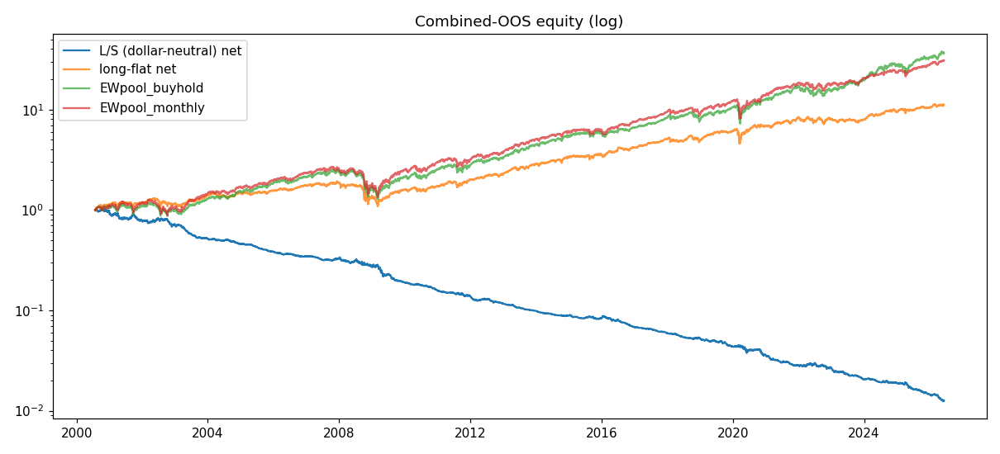
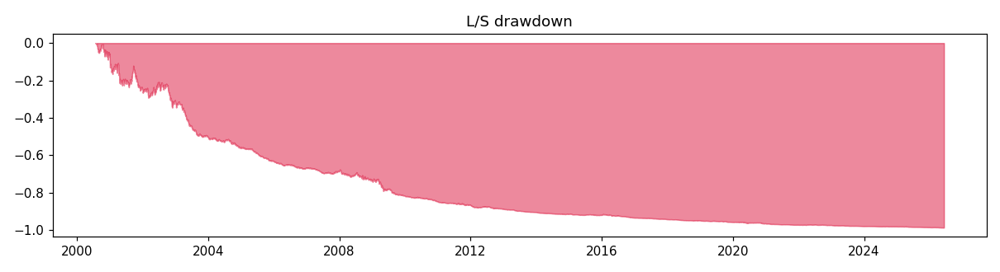
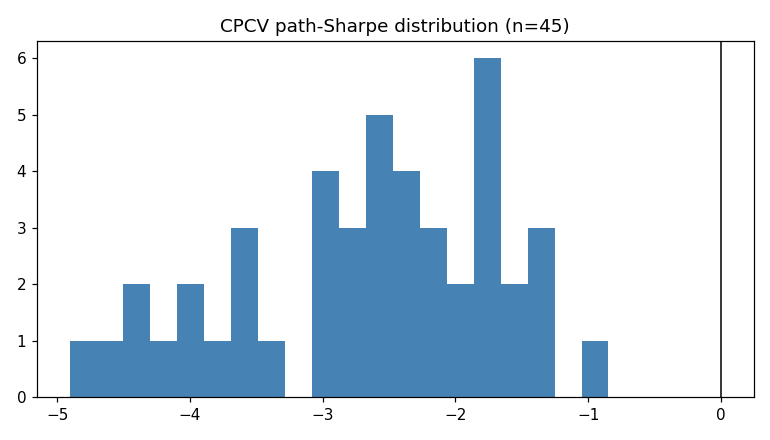

# RESULTS — RUN 2 (DEEP, EXPLORATORY)

> **SURVIVORSHIP-BIAS CAVEAT (read first).** This run uses free yfinance daily history
> for a pool of names that *survived to today*; delisted/dead tickers are absent, so
> absolute returns are upward-biased. It is benchmarked ONLY against equal-weight
> buy-and-hold of its OWN pool (bias cancels in the relative comparison). It is
> **NOT deployable** and is **never** to be headlined vs SPY.

- Primary benchmark: **EWpool_buyhold** | books: dollar-neutral L/S + long-flat breadth
- Honest N (registry trials): **17**
- CPCV paths: n=45, mean Sharpe -2.662 (std 0.983), frac>0 0.00

## Books vs benchmarks (combined OOS)

### long_short  (ann Sharpe -1.830, turnover 0.126, cost 6.6bps, 6506 days)

| benchmark | strat CAGR | bench CAGR | strat Sharpe | alpha (ann) | beta | maxDD |
|---|---|---|---|---|---|---|
| EWpool_buyhold | -15.6% | +14.9% | -1.83 | -16.7% | 0.01 | -98.8% |
| EWpool_monthly | -15.6% | +14.2% | -1.83 | -16.6% | 0.01 | -98.8% |

### long_flat  (ann Sharpe 0.714, turnover 0.021, cost 0.9bps, 6506 days)

| benchmark | strat CAGR | bench CAGR | strat Sharpe | alpha (ann) | beta | maxDD |
|---|---|---|---|---|---|---|
| EWpool_buyhold | +9.8% | +14.9% | 0.71 | +10.8% | -0.02 | -43.7% |
| EWpool_monthly | +9.8% | +14.2% | 0.71 | +10.8% | -0.02 | -43.7% |

## Predictor diagnostics (OOS)

- IC mean 0.0214 (IR 0.109), hit 0.505, pinball 1.6739
- coverage 80/90: 0.715 / 0.837, n_obs 995418

## Per-year (L/S vs primary)

| year | strat | bench | strat Sharpe |
|---|---|---|---|
| 2000 | -1.6% | +10.2% | -0.22 |
| 2001 | -20.5% | +0.1% | -1.24 |
| 2002 | -8.6% | -11.6% | -0.60 |
| 2003 | -27.6% | +33.4% | -4.06 |
| 2004 | -11.6% | +19.0% | -2.01 |
| 2005 | -16.2% | +18.0% | -4.32 |
| 2006 | -9.3% | +16.8% | -2.08 |
| 2007 | -5.6% | +15.1% | -1.10 |
| 2008 | -16.3% | -32.1% | -1.10 |
| 2009 | -31.0% | +27.4% | -2.24 |
| 2010 | -16.6% | +19.0% | -3.60 |
| 2011 | -12.7% | +9.8% | -1.82 |
| 2012 | -15.3% | +18.4% | -2.65 |
| 2013 | -15.6% | +37.2% | -5.41 |
| 2014 | -10.6% | +20.9% | -3.02 |
| 2015 | -5.9% | +7.5% | -1.14 |
| 2016 | -17.8% | +12.0% | -2.71 |
| 2017 | -13.4% | +25.2% | -4.17 |
| 2018 | -10.8% | -2.7% | -1.91 |
| 2019 | -17.4% | +31.5% | -2.68 |
| 2020 | -17.4% | +20.6% | -1.19 |
| 2021 | -21.7% | +35.3% | -3.49 |
| 2022 | -5.2% | -10.2% | -0.44 |
| 2023 | -23.0% | +28.4% | -3.71 |
| 2024 | -7.5% | +37.6% | -1.29 |
| 2025 | -23.5% | +20.2% | -2.93 |
| 2026 | -13.2% | +11.0% | -4.01 |

## Per-regime (L/S vs primary)

| regime | strat | bench | strat Sharpe | maxDD |
|---|---|---|---|---|
| 2000-02 dot-com bust | -28.5% | -2.5% | -0.84 | -34.6% |
| 2003-07 recovery bull | -55.7% | +146.9% | -3.01 | -55.9% |
| 2008 GFC | -18.3% | -37.9% | -0.82 | -23.7% |
| 2009-11 QE recovery | -42.7% | +85.6% | -2.67 | -42.8% |
| 2011 EU crisis | -6.8% | -0.1% | -1.42 | -7.6% |
| 2012-15 bull | -39.2% | +107.3% | -3.17 | -39.5% |
| 2015-16 selloff | -4.2% | +6.9% | -0.54 | -10.9% |
| 2016H2-17 low-vol bull | -26.5% | +33.7% | -4.84 | -27.4% |
| 2018 volmageddon | -10.8% | +14.3% | -3.69 | -11.2% |
| 2018Q4 correction | +0.0% | -14.9% | 0.07 | -2.8% |
| 2019 rate-cut bull | -17.4% | +31.5% | -2.68 | -17.5% |
| 2020 COVID crash | +2.2% | -17.8% | 0.83 | -3.9% |
| 2020 V-recovery | -19.2% | +46.8% | -1.67 | -19.8% |
| 2021 melt-up | -21.7% | +35.3% | -3.49 | -20.8% |
| 2022 rate-hike BEAR | -5.2% | -10.2% | -0.44 | -13.2% |
| 2023Q1 bank crisis | -9.3% | +7.5% | -4.51 | -9.8% |
| 2023 narrow AI rally | -15.1% | +19.5% | -3.40 | -16.8% |
| 2024 broad bull | -7.5% | +37.6% | -1.29 | -9.8% |
| 2025 tariff vol | -23.5% | +20.2% | -2.93 | -24.4% |
| 2026H1 elevated vol | -13.2% | +11.0% | -4.01 | -15.3% |

## Firewall (reported, NOT enforced)

- **DSR** = 0.000 (SR -0.1153, SR0 0.1132, N 17, T 6506) — gate dsr_min 0.95 → FAIL
- **PBO** = 0.0 (configs 4) — gate pbo_max 0.20 → PASS
- **DM vs EWpool_buyhold**: stat 7.653, p 0.000, meanΔ 1.28e-03 (neg stat = strat better)
- **DM vs EWpool_monthly**: stat 7.306, p 0.000, meanΔ 1.25e-03 (neg stat = strat better)

## Pool (153 survivor names)

See `pool.csv`. First-date sample:

AAPL, ABT, ADBE, ADI, ADP, AEP, AFL, AIG, AMAT, AMD, AMGN, AMT, AMZN, APD, AXP, AZO, BA, BAC, BDX, BKNG, BLK, BMY, BRK.B, BSX, C, CAT, CB, CCI, CDNS, CI, CL, CMCSA, COF, COP, COST, CSCO, CSX, CVS, CVX, D
